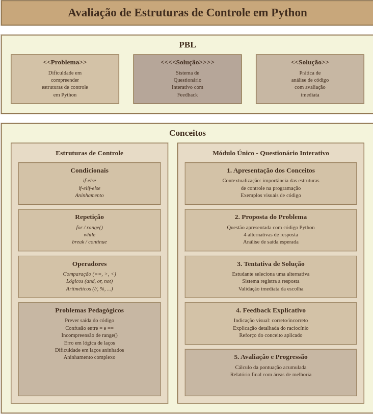

# Quiz de Objetos de Aprendizagem

## 📋 Sobre o Projeto

Este projeto consiste em um quiz interativo desenvolvido como objeto de aprendizagem para auxiliar no processo de ensino e aprendizado de programação Python.

## 🎯 Público Alvo

Este quiz é direcionado para **iniciantes no curso de programação**, que estão dando seus primeiros passos no aprendizado de programação e precisam consolidar conceitos fundamentais da linguagem Python.

## 📚 Requisitos de Aprendizagem

Ao finalizar este quiz, o estudante será capaz de:

1. **Compreender estruturas condicionais**: Identificar e aplicar estruturas `if`, `else` e `elif` em situações práticas
2. **Dominar operadores de comparação**: Utilizar corretamente operadores como `==`, `!=`, `>`, `<`, `>=`, `<=` para comparar valores
3. **Aplicar operadores aritméticos**: Compreender o uso de operadores básicos (`+`, `-`, `*`, `/`, `//`, `%`) e suas diferenças
4. **Trabalhar com estruturas de repetição**: Entender e implementar laços `for` e `while` em diferentes contextos
5. **Utilizar a função `range()`**: Compreender os diferentes formatos de `range()` e sua aplicação em laços
6. **Aplicar operadores lógicos**: Utilizar operadores `and`, `or` e `not` em expressões condicionais
7. **Entender estruturas aninhadas**: Compreender e aplicar estruturas condicionais e de repetição aninhadas
8. **Controlar fluxo de execução**: Utilizar comandos `break` para interromper laços quando necessário
9. **Analisar código Python**: Ler e interpretar trechos de código Python, identificando sua saída esperada

## 🗺️ Mapa Conceitual

Para visualizar a estrutura conceitual e os relacionamentos entre os temas abordados neste objeto de aprendizagem, consulte o mapa conceitual disponível em:

**Link do Mapa Conceitual ja revisado e arrumado**: [https://cmapscloud.ihmc.us:443/rid=21XSBGVWZ-HCVPB0-BNQHXX](https://cmapscloud.ihmc.us:443/rid=21XSBGVWZ-HCVPB0-BNQHXX)

## 📖 Modelo Instrucional

O modelo instrucional detalhando a metodologia de ensino, estratégias pedagógicas e organização didática deste objeto de aprendizagem pode ser visualizado abaixo:

---

## 📘 Plano de Aula

O plano de aula completo para utilização deste objeto de aprendizagem em sala de aula está disponível em:

**📄 [PLANO_DE_AULA.md](PLANO_DE_AULA.md)** (localizado na raiz do projeto)

O plano de aula inclui:
- Objetivos de aprendizagem
- Estrutura detalhada da aula (50 minutos)
- Estratégias metodológicas
- Critérios de avaliação
- Instruções para gravação do vídeo tutorial
- Atividades complementares
- Adaptações para diferentes perfis de estudantes

---

## 🚀 Como Utilizar

1. Clone este repositório
2. Instale as dependências: `npm install`
3. Execute o projeto: `npm run dev`
4. Acesse o quiz e comece a praticar!

## 📝 Licença

Este projeto está sob a licença especificada no arquivo LICENSE.
